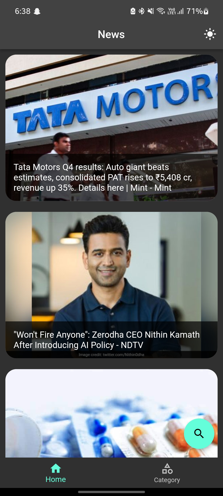
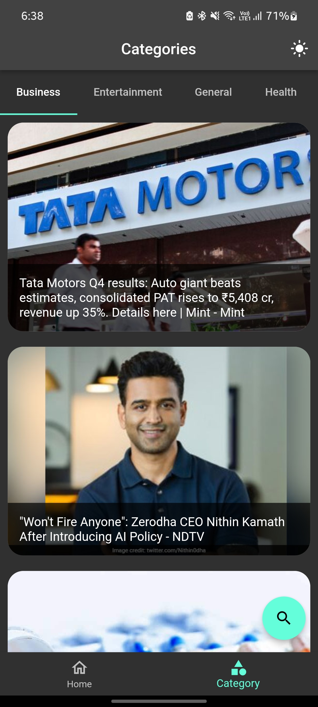
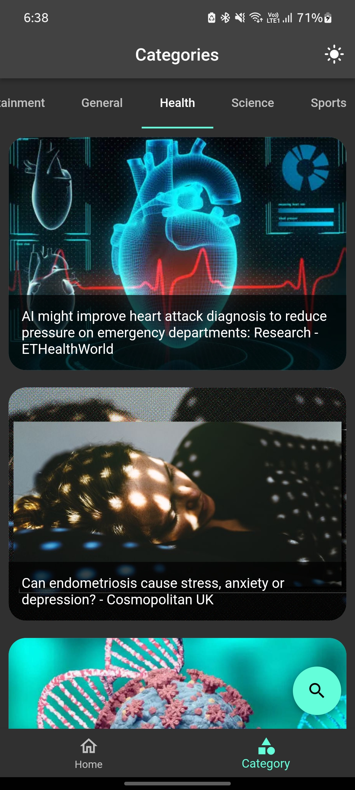
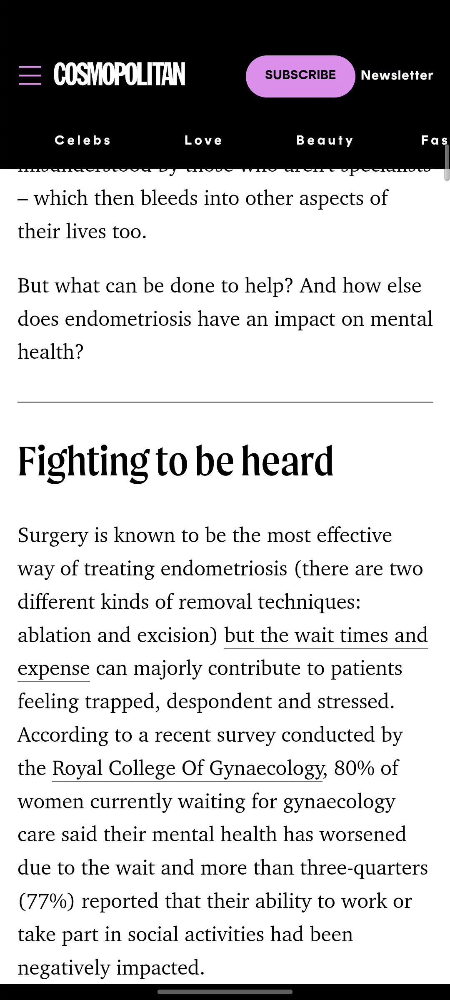
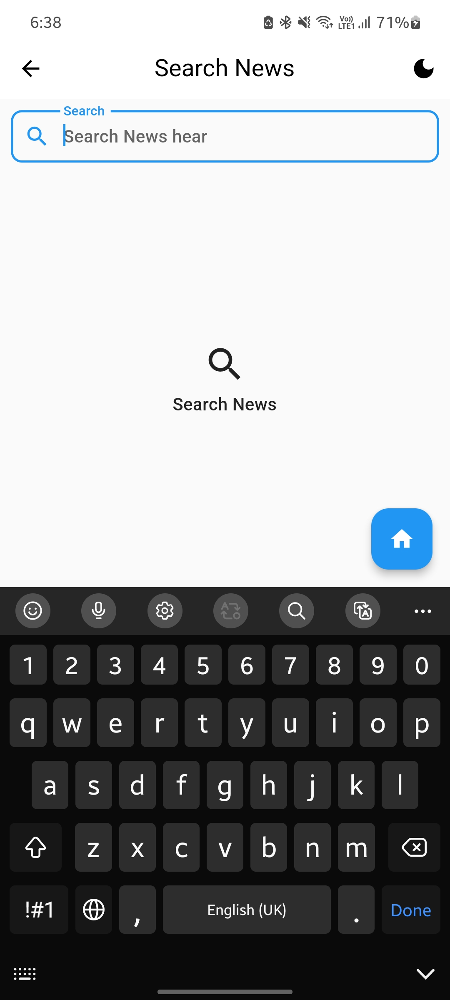
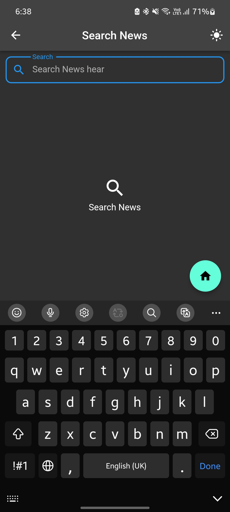
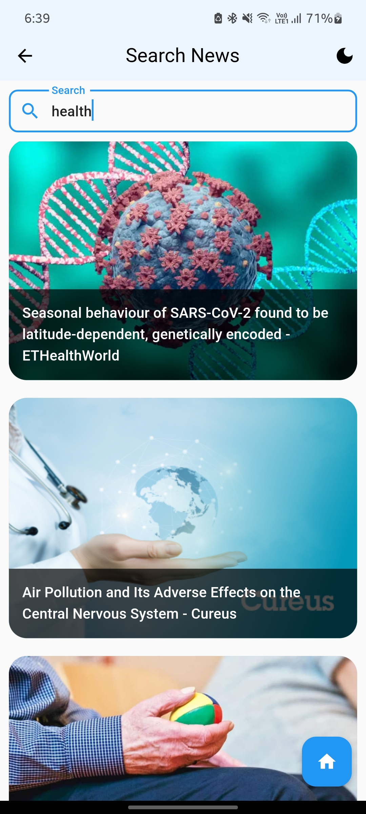

# **News App**
Made by Priyanshi Baldha.

---

## ⚙️ Features

- Main features are as follows:
    - Light & Dark Theme
    - splash Screen
    - Search functionality
    - Category wise News
    - Read Details of news
    - News with Image
    - Display news Using dio package
    - Display news Using API Calling
   

## 📲 Screenshots

## 📽️ GIF

https://github.com/priyanshiBaldha/News_app_Flutter/assets/113037698/f99d6820-c3d7-47c4-a322-9ba9fbfe904d

  

 
---
### You can show some respect by starring 🌟 the repository!
---

